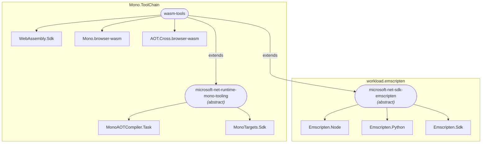

# WorkloadVersioningSample

## Current wasm-tools dependency graph

### Workload packs

- **WebAssembly.Sdk**: Build logic for WASM / AOT
- **Mono.browser-wasm**: Mono browser-wasm runtime pack.  Not imported as SDK, but via KnownFrameworkReference or KnownRuntimePack items.
- **AOT.Cross.browser-wasm**: AOT Compiler EXE (mono-aot-cross.exe)
- **MonoAOTCompiler.Task**: Includes (only) the MonoAOTCompiler task
- **MonoTargets.Sdk**: Mono MSBuild logic and tasks shared between ios, android, and wasm
- **Emscripten.Node**: Includes Node
- **Emscripten.Python**: Includes Python
- **Emscripten.Sdk**: Includes Emscripten

## Proposed dependency graph for .NET 6 and 7

```mermaid
graph TD;

    subgraph Mono.ToolChain.6.0.100
    wasm-tools.6.0.100([wasm-tools])-->Microsoft.NET.Runtime.WebAssembly.Sdk.6.0.100[WebAssembly.Sdk];
    wasm-tools.6.0.100-->|extends|microsoft-net-runtime-mono-tooling.6.0.100;
    microsoft-net-runtime-mono-tooling.6.0.100(["microsoft-net-runtime-mono-tooling<BR><I>(abstract)</I>"])-->Microsoft.NET.Runtime.MonoTargets.Sdk.6.0.100[MonoTargets.Sdk];
    end
    
    wasm-tools.6.0.100-->wasm-tools-net6-abstract
    %%microsoft-net-runtime-mono-tooling-->microsoft-net-runtime.6-mono-tooling

    subgraph Mono.ToolChain.net6
    wasm-tools-net6-abstract([wasm-tools-net6-abstract])-->Mono.browser-wasm.net6
    Mono.browser-wasm.net6-->|alias|Mono.browser-wasm.v6["Mono.browser-wasm v6.0.0"]
    wasm-tools-net6-abstract-->AOT.Cross.browser-wasm.net6
    AOT.Cross.browser-wasm.net6-->|alias|AOT.Cross.browser-wasm.v6["AOT.Cross.browser-wasm v6.0.0"]
    wasm-tools-net6-abstract-->|extends|microsoft-net-runtime.6-mono-tooling;
    microsoft-net-runtime.6-mono-tooling(["microsoft-net-runtime.6-mono-tooling<BR><I>(abstract)</I>"])-->MonoAOTCompiler.Task.net6;
    MonoAOTCompiler.Task.net6-->|alias|MonoAOTCompiler.Task.v6["MonoAOTCompiler.Task v6.0.0"]
    end
    
    wasm-tools-net6-abstract---->|extends|microsoft-net-sdk6-emscripten;

    subgraph workload.emscripten.net6
    microsoft-net-sdk6-emscripten(["microsoft-net6-sdk-emscripten<BR><I>(abstract)</I>"])-->Microsoft.NET.Runtime.6.Emscripten.Node[Emscripten.Node.6];
    Microsoft.NET.Runtime.6.Emscripten.Node-->|alias|Microsoft.NET.Runtime.Emscripten.Node.v6["Emscripten.Node v6.0.0"]
    microsoft-net-sdk6-emscripten-->Microsoft.NET.Runtime.6.Emscripten.Python[Emscripten.Python.6];
    Microsoft.NET.Runtime.6.Emscripten.Python-->|alias|Microsoft.NET.Runtime.Emscripten.Python.v6["Emscripten.Python v6.0.0"]
    microsoft-net-sdk6-emscripten-->Microsoft.NET.Runtime.6.Emscripten.Sdk[Emscripten.Sdk.6];
    Microsoft.NET.Runtime.6.Emscripten.Sdk-->|alias|Microsoft.NET.Runtime.Emscripten.Sdk.v6["Emscripten.Sdk v6.0.0"]
    end
    
    subgraph Mono.ToolChain.7.0.100
    wasm-tools.7.0.100([wasm-tools])-->Microsoft.NET.Runtime.WebAssembly.Sdk.7.0.100[WebAssembly.Sdk];
    wasm-tools.7.0.100-->|extends|microsoft-net-runtime-mono-tooling.7.0.100;
    microsoft-net-runtime-mono-tooling.7.0.100(["microsoft-net-runtime-mono-tooling<BR><I>(abstract)</I>"])-->Microsoft.NET.Runtime.MonoTargets.Sdk.7.0.100[MonoTargets.Sdk];
    end
    
    wasm-tools.7.0.100-->wasm-tools-net7-abstract
    
    subgraph Mono.ToolChain.net7
    wasm-tools-net7-abstract([wasm-tools-net7-abstract])-->Mono.browser-wasm.net7
    Mono.browser-wasm.net7-->|alias|Mono.browser-wasm.v7["Mono.browser-wasm v7.0.0"]
    wasm-tools-net7-abstract-->AOT.Cross.browser-wasm.net7
    AOT.Cross.browser-wasm.net7-->|alias|AOT.Cross.browser-wasm.v7["AOT.Cross.browser-wasm v7.0.0"]
    wasm-tools-net7-abstract-->|extends|microsoft-net-runtime.7-mono-tooling;
    microsoft-net-runtime.7-mono-tooling(["microsoft-net-runtime.7-mono-tooling<BR><I>(abstract)</I>"])-->MonoAOTCompiler.Task.net7;
    MonoAOTCompiler.Task.net7-->|alias|MonoAOTCompiler.Task.v7["MonoAOTCompiler.Task v7.0.0"]
    end
    
    wasm-tools-net7-abstract---->|extends|microsoft-net-sdk7-emscripten;
    
    subgraph workload.emscripten.net7
    microsoft-net-sdk7-emscripten(["microsoft-net7-sdk-emscripten<BR><I>(abstract)</I>"])-->Microsoft.NET.Runtime.7.Emscripten.Node[Emscripten.Node.7];
    Microsoft.NET.Runtime.7.Emscripten.Node-->|alias|Microsoft.NET.Runtime.Emscripten.Node["Emscripten.Node v7.0.0"]
    microsoft-net-sdk7-emscripten-->Microsoft.NET.Runtime.7.Emscripten.Python[Emscripten.Python.7];
    Microsoft.NET.Runtime.7.Emscripten.Python-->|alias|Microsoft.NET.Runtime.Emscripten.Python["Emscripten.Python v7.0.0"]
    microsoft-net-sdk7-emscripten-->Microsoft.NET.Runtime.7.Emscripten.Sdk[Emscripten.Sdk.7];
    Microsoft.NET.Runtime.7.Emscripten.Sdk-->|alias|Microsoft.NET.Runtime.Emscripten.Sdk["Emscripten.Sdk v7.0.0"]
    end

```

