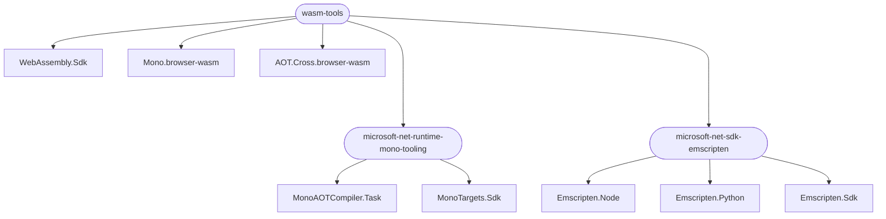

# WorkloadVersioningSample

# Current wasm-tools dependency graph

```mermaid
  graph TD;
      wasm-tools([wasm-tools])-->Microsoft.NET.Runtime.WebAssembly.Sdk[WebAssembly.Sdk];
      wasm-tools-->Microsoft.NETCore.App.Runtime.Mono.browser-wasm[Mono.browser-wasm];
      wasm-tools-->Microsoft.NETCore.App.Runtime.AOT.Cross.browser-wasm[AOT.Cross.browser-wasm];
      wasm-tools---->microsoft-net-runtime-mono-tooling;
      wasm-tools---->microsoft-net-sdk-emscripten;
      microsoft-net-runtime-mono-tooling([microsoft-net-runtime-mono-tooling])-->Microsoft.NET.Runtime.MonoAOTCompiler.Task[MonoAOTCompiler.Task];
      microsoft-net-runtime-mono-tooling-->Microsoft.NET.Runtime.MonoTargets.Sdk[MonoTargets.Sdk];
      microsoft-net-sdk-emscripten([microsoft-net-sdk-emscripten])-->Microsoft.NET.Runtime.Emscripten.Node[Emscripten.Node];
      microsoft-net-sdk-emscripten-->Microsoft.NET.Runtime.Emscripten.Python[Emscripten.Python];
      microsoft-net-sdk-emscripten-->Microsoft.NET.Runtime.Emscripten.Sdk[Emscripten.Sdk];
```
