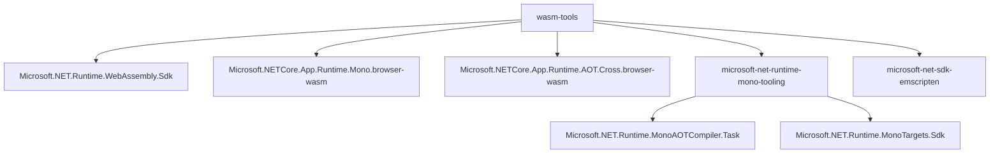

# WorkloadVersioningSample

# WASM Tools dependency graph

```mermaid
  graph TD;
      wasm-tools-->Microsoft.NET.Runtime.WebAssembly.Sdk;
      wasm-tools-->Microsoft.NETCore.App.Runtime.Mono.browser-wasm;
      wasm-tools-->Microsoft.NETCore.App.Runtime.AOT.Cross.browser-wasm;
      wasm-tools-->microsoft-net-runtime-mono-tooling;
      wasm-tools-->microsoft-net-sdk-emscripten;
      microsoft-net-runtime-mono-tooling-->Microsoft.NET.Runtime.MonoAOTCompiler.Task;
      microsoft-net-runtime-mono-tooling-->Microsoft.NET.Runtime.MonoTargets.Sdk;
```
